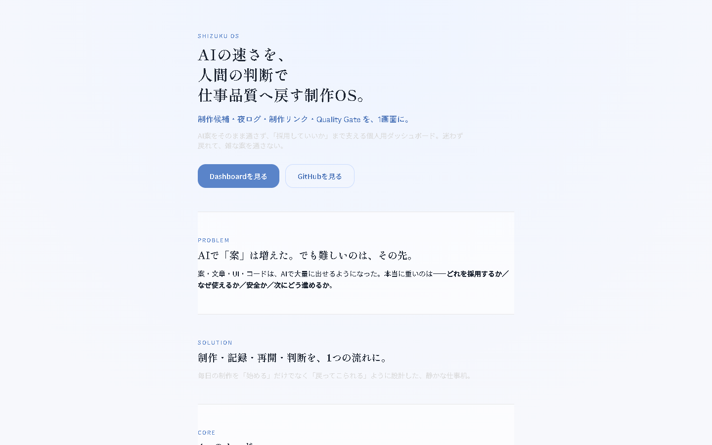
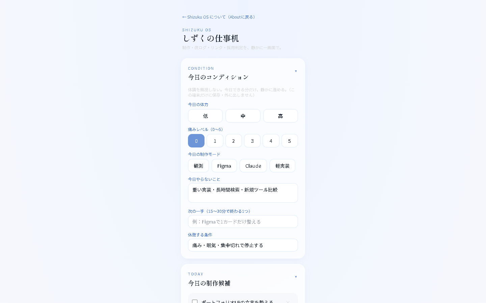
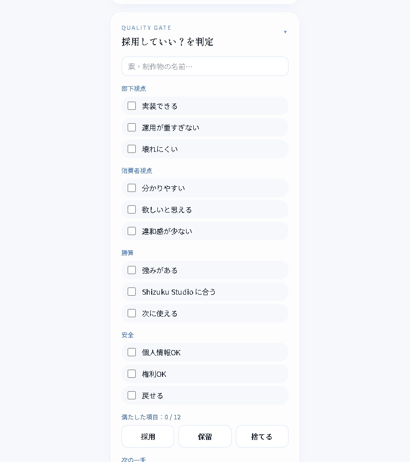

# Shizuku OS Dashboard

**AIの速さを、人間の判断で仕事品質へ戻す制作OS。**
制作候補・夜タスクログ・制作リンク・Quality Gate を核に、**12カード**を1画面へ縦に積んだ、しずく専用の個人ダッシュボード。スマホ幅（360px前後）に合わせた、水色×白×薄グレーの静かなUI。

> **公開中：v0.18・12カード**（2026-08-30 確認：公開URLで配信中のビルドと `origin/main` のビルド結果が一致）。
> **ローカル：v0.19**（表記の事実整合のみ。機能・UIの変更なし。デプロイは承認後）

🔗 公開URL：https://shizuku-os-dashboard.vercel.app/

## スクリーンショット



> スクリーンショットは v0.17（11カード）時点のもの。v0.18 で「今日の次アクション」が加わり12カードになっています。


---

## 背景

AIで案・文章・UI・コードは大量に出せるようになった。
でも本当に重いのは、**どれを採用するか／なぜ使えるか／安全か／次にどう進めるか**。
Shizuku OS は、その「判断」と「再開」を支えるための小型OS。

> 思想の詳細は [`docs/PRODUCT_VISION.md`](./docs/PRODUCT_VISION.md)。

---

## 主な機能

- **今日のコンディション**：体力・痛み・制作モード・休憩条件を記録。機微情報としてJSONバックアップから除外。
- **今日の次アクション**：迷った時の「これ1つ」を上部に固定表示。完了チェック付き。
- **今日の制作候補**：優先度（高/中/低）と状態（今日/明日/保留）でタスク管理。チェック・追加・削除。
- **夜タスク3行ログ**：「やった / 学び / 次やる」を1日分として記録。新しい順に並ぶ。
- **制作中リンク**：Figma / GitHub / メモ / 参考URL を編集・追加。URLは「開く」リンクに。
- **Quality Gate**：AI案・制作物を「採用 / 保留 / 捨てる」で判定（部下視点・消費者視点・勝算・安全 × 各3項目＋次の一手）。判定は**履歴に保存**でき、過去の採用/保留/捨てるを見返せる（v0.2）。履歴は**Obsidian用Markdownでコピー**できる（v0.3）。履歴は判定（採用/保留/捨てる）で**絞り込める**（v0.4）。
- **localStorage 保存**：入力はすべてこの端末内に自動保存。外部送信なし。保存できなかった場合は画面上部に警告を出す（黙って消さない）。
- **AI Role Router**：タスク種別ごとに「どのAIに投げるか」を示す早見（Opus 5主・Fable 5は最難関だけ）。
- **Prompt Builder（＋Vault）**：目的・制約・出力形式・やらないこと からプロンプトを生成。名前をつけて保存し、対象AI・お気に入りで絞り込んで再コピーできる。
- **Brand Panel**：冷色トークン・フォント・世界観キーワードを表示（デザインの一貫性を可視化）。
- **Weekly Review**：週次の やった/学び/次/来週の重点 を書いて保存。Obsidian用Markdownでコピー（§10週次レビュー）。
- **n8n Bridge（JSON入出力）**：全データをJSONでコピー/ダウンロード/読み込み。バックアップ＆将来のn8n受け渡し口（外部送信なし）。読み込み時は各カードの形式を検証し、合わないものがあれば**保存せずに中止**してエラーを表示。
- **今日はここまででOK（Retire OK）**：今日やったこと・状態・止める理由・再開地点・次の一手を残す。
- **Landing（紹介ページ）**：作品として「何か・なぜ作ったか」を伝える1ページ。

---

## ページ構成

依存を増やさない**軽量ハッシュルーティング**で2画面を切り替えます。

| URL | 内容 |
|---|---|
| `/`（既定） | Landing（Shizuku OS の紹介） |
| `/#/dashboard` | Dashboard（12カード＋折りたたみ） |

- Landing の「Dashboardを見る」→ Dashboard へ
- Dashboard の「← Aboutに戻る」→ Landing へ

> ハッシュ方式（`#/dashboard`）にしているのは、React Router 等の依存を足さず、サーバー設定（SPA rewrite）も変えずに動かすため。

---

## 技術構成

- **React** + **TypeScript**（画面と型）
- **Vite**（開発サーバー・ビルド）
- **Tailwind CSS**（配色・レイアウト。トークンは `tailwind.config.js`）
- **localStorage**（保存。外部DB・サーバーなし）

---

## 起動方法

```bash
npm install   # 1回だけ：必要な部品を入れる
npm run dev   # 開発サーバーを起動（http://localhost:5173）
```

止めるときはターミナルで `Ctrl + C`。

## 本番ビルド（確認用）

```bash
npm run build
npm run preview
```

## デプロイ（Vercel・公開済み）
- Framework Preset：**Vite** ／ Build Command：`npm run build` ／ Output Directory：`dist` ／ Environment Variables：**なし**
- 公開URL：https://shizuku-os-dashboard.vercel.app/

---

## 現在やっていないこと（v0.19）

- ログイン / 認証
- 外部API接続
- n8n 本接続
- GitHub 自動連携
- 課金
- 通知
- 複数ユーザー対応

---

## 安全メモ

- データ保存は **localStorage のみ**（この端末内だけ・外部送信なし）
- APIキー・秘密情報は**使っていない**
- 外部サービス連携は**未実装**

## GitHub公開前チェック（このプロジェクトの状態）
- [x] APIキー・秘密情報なし（`src` 全文検索で確認済み）
- [x] localStorage のみ・外部API接続なし
- [x] `.gitignore` で node_modules / dist / .env / .vercel を除外
- [x] `npm run build` が通る
- [x] README がポートフォリオ用に読める
- [x] GitHub 公開済み＋Vercel 公開済み

## Feedback Loop（公開後）
作って終わりにせず、公開後の反応を「改善／次タスク／Obsidian」に戻す前提。→ [`docs/FEEDBACK_LOOP.md`](./docs/FEEDBACK_LOOP.md)

## Roadmap
v0.19 時点で、12カード・折りたたみ・週次振り返りまで実装済み。外部API接続とn8n本接続は未実装。→ [`docs/ROADMAP.md`](./docs/ROADMAP.md)

---

## 変更履歴
- **v0.19（ローカルのみ・未デプロイ）**：表記の事実整合。AI Role Router のモデル名を正本（`.claude/rules/model-usage.md`・2026-08-25）へ更新（Opus 4.8 → **Opus 5**／Sonnet 4.6 → **Sonnet 5**）。あわせて README・RELEASE_LOG・各下書きにあった「公開URLへ未反映」の記述を、実測（公開中のビルドと `origin/main` のビルド結果が一致）に合わせて訂正。ROADMAP・PORTFOLIO_NOTE の古い記載も実態へ。**機能追加・UI変更なし。**
- **v0.18（公開中）**：「今日の次アクション」カードを追加して**12カード**に（迷ったらこれ1つ・上部固定・完了チェック）。Figma準拠。
  あわせて監査対応：JSON読み込みの形式検証（不正なら保存も再読み込みもせず中止）、localStorage 保存失敗の通知、チェックボックス・選択ボタンの読み上げ対応（`aria-labelledby` / `aria-pressed`）。
- **v0.17**：「今日はここまででOK（Retire OK）」カードを追加して11カードに（Figma準拠）。今日やったこと/状態/やめる理由/次に戻る場所/次の一手を残して安全に区切る。
- **v0.16**：今日のコンディション（体力/痛み/制作モード/やらないこと/次の一手/休憩条件）カードを追加。体調込みで制作を続けるため。データは端末内のみ・バックアップにも含めない。
- **v0.15**：今日の制作候補を Figma 準拠に（優先度＝高/中/低、状態＝今日/明日/保留 を追加）。
- **v0.14**：カード開閉状態を保存（次回も同じ状態で戻れる）／JSONバックアップに Weekly Review を追加。
- **v0.13**：Weekly Review（週次振り返り＋Obsidian Markdown出力）カードを追加。
- **v0.12**：カードの折りたたみを追加（見出しタップで開閉。ツール/参照系は初期折りたたみ）。
- **v0.11**：n8n Bridge（全データの JSON エクスポート/インポート・バックアップ）を追加。
- **v0.10**：Prompt Builder に保存・再利用（Vault）を統合（名前/対象AI/お気に入り/絞り込み/コピー）。
- **v0.9**：Brand Panel（配色・フォント・世界観キーワード）カードを追加。
- **v0.8**：アクセシビリティ仕上げ（フォーカス可視化・reduced-motion対応・削除ボタンのタップ領域拡大）。
- **v0.7**：Prompt Builder（フォーム→プロンプト生成・コピー）カードを追加。
- **v0.6**：AI Role Router（タスク種別→推奨AI/ツール）カードを追加。
- **v0.5**：夜タスクログ・制作中リンクに空状態メッセージを追加（迷わず戻れる強化）。
- **v0.4**：Quality Gate 履歴を判定（採用/保留/捨てる）で絞り込む機能を追加。
- **v0.3**：Quality Gate 履歴を Obsidian 向け Markdown（frontmatter付き）でコピーする機能を追加。
- **v0.2**：Quality Gate に判定履歴（保存・一覧・削除、localStorage）を追加。
- **v0.1**：4カード＋Landing＋ハッシュルーティングで初回公開。

## 今後の予定

外部API接続・n8n本接続など、v0.19 時点で未実装の候補は [`docs/ROADMAP.md`](./docs/ROADMAP.md) で管理します。

---

## リポジトリ内のドキュメント（実在するものだけ）

| ファイル | 役割 |
|---|---|
| [`README.md`](./README.md) | 起動方法・機能・構成（このファイル） |
| [`docs/PRODUCT_VISION.md`](./docs/PRODUCT_VISION.md) | 思想・壊してはいけない価値 |
| [`docs/ROADMAP.md`](./docs/ROADMAP.md) | 実装の順番・未実装の候補 |
| [`docs/FEEDBACK_LOOP.md`](./docs/FEEDBACK_LOOP.md) | 公開後の反応を次へ戻す手順 |
| [`docs/RELEASE_LOG.md`](./docs/RELEASE_LOG.md) | リリース記録 |
| [`docs/PUBLIC_DESCRIPTION.md`](./docs/PUBLIC_DESCRIPTION.md) | 公開用の説明文 |
| [`docs/PORTFOLIO_NOTE.md`](./docs/PORTFOLIO_NOTE.md) | ポートフォリオ用のまとめ |

> **`CLAUDE.md` と `STYLE_GUIDE.md` はこのリポジトリには置いていない。**
> AIの作業ルールとデザイントークン（配色・フォント・余白）は、ワークスペース側の
> `.claude/rules/`（`design-system.md` / `accessibility.md` / `ui-patterns.md`）を正本とする。
> 実装した色・フォントは `tailwind.config.js` に写してある。
